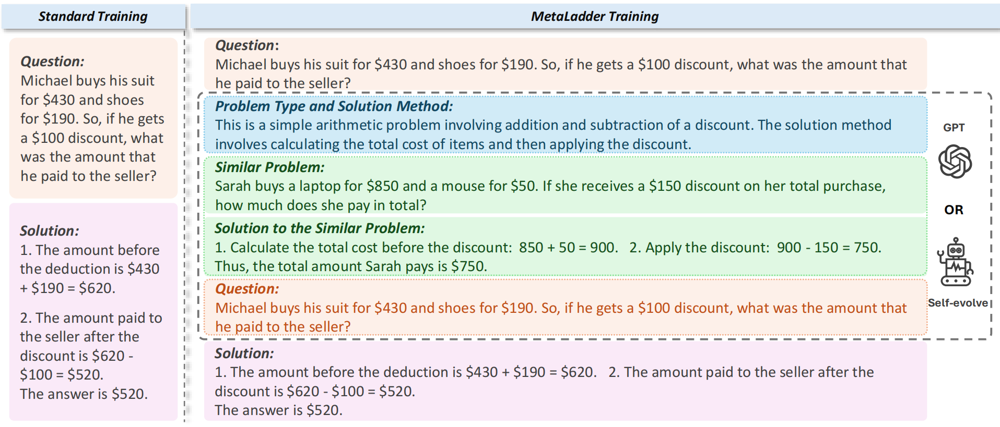

# MetaLadder
The code for paper **"MetaLadder: Ascending Mathematical Solution Quality via Analogical-Problem Reasoning Transfer"**.


Large Language Models (LLMs) excel in mathematical reasoning using Chain-of-Thought (CoT) techniques. However, unlike human problem-solving—which often leverages analogous past examples—current methods directly generate answers. Inspired by this, we introduce MetaLadder, a framework that prompts LLMs to recall similar meta-problems and their CoT solutions before tackling the target problem. Experiments on mathematical benchmarks show that MetaLadder boosts accuracy by 10.3% over standard CoT approaches.

Paper link: [https://arxiv.org/abs/2503.14891](https://arxiv.org/abs/2503.14891)


## ⚙️ Setup

```
conda create -n metaladder --yes python=3.11
conda activate metaladder
pip install -r requirements.txt
```
## 📂 Data
All required data is located in the `./data` directory and includes:
- Original CoT data
- MetaLadder-enhanced data
- MetaLadder+Reverse data 
- RefAug-augmented data
- MetaLadder-enhanced MetaMath data
- MetaLadder-enhanced AugCoT data

## 🔨 Training
1. Clone LLaMA-Factory
    ```
    git clone https://github.com/hiyouga/LLaMA-Factory
    ``` 

2. Configure Training
    
    - Update the training set configurations in `./LLaMA-Factory/data/dataset_info.sh`
    - Customize the training prompt in `./LLaMA-Factory/src/llamafactory/data/template.py`.
  
3. Start Training
   ```
   bash train.sh
   ```


## ⚖️ Evaluation
- Normal Testing
  
  Execute the test script:
  ```
  bash test.sh
  ```
- Shortcut Inference
  
  Run the shortcut inference script:
  ```
  bash shortcut.sh
  ```
  
## 🔄 Self-evolution
1. Data Sampling
   - For standard data sampling, run:

     ```
     bash sample.sh
     ```
   - For sampling on reversed data, run:

     ```
     bash reverse_sample.sh
     ```
2. Data Augmentation

   Append the sampled data to the original dataset.
3. Retrain the Base Model

   ```
   bash train.sh
   ```
